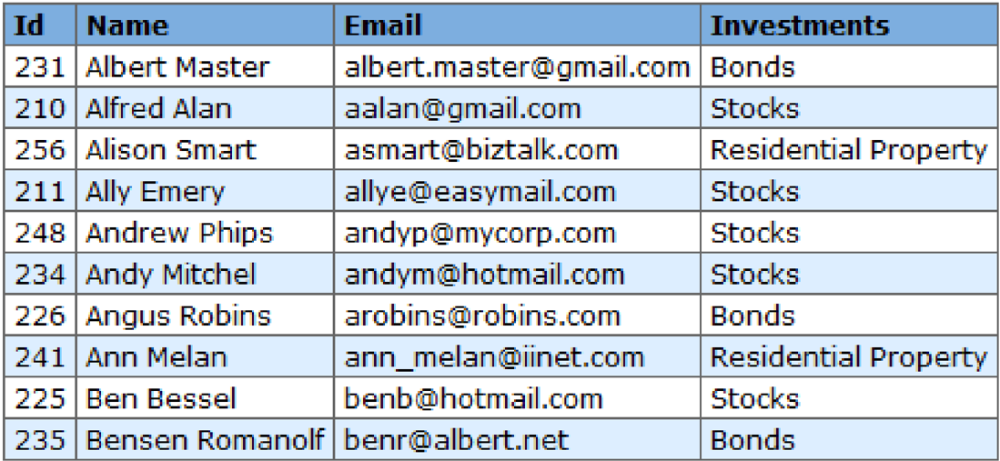

## Annual Client Portfolio &amp; Investment Strategy Report

## 1. Executive Summary

This document provides a detailed analysis of the high-priority client segment identified in the "Tier 2 Investor Table." The dataset comprises ten distinct individuals with varied investment profiles ranging from low-risk fixed-income securities to higher-risk residential property and equity markets. This report is designed to serve as a foundational document for our Retrieval-Augmented Generation (RAG) system, providing the necessary context, cross-references, and analytical depth to answer complex queries regarding client behavior and asset allocation.

## 2. Visual Reference: Client Overview Table

> **Table (image)**: Table exists in image form.
> <!-- table-image-uuid: 1f114bcf-1aee-6391-89ec-389771e8c0f7 -->
> 
> <!-- table-image-vlm-json-path: table_image_vlm/table-1-1f114bcf-1aee-6391-89ec-389771e8c0f7/output.json -->
> **Table summary (VLM)**: The table represents the high-priority client segment for RAG system queries, detailing ten investors' investment allocations. It identifies five clients (Ids 210, 211, 248, 234, 225) concentrated in Stocks (50% of the group), aligning with the context's emphasis on "aggressive growth" behavior and capital appreciation. This data enables the RAG system to retrieve specific equity exposure insights for queries like "aggressive growth," directly supporting the document’s focus on sector distributi

## 3. Sector Distribution and Market Sentiment

## 3.1 The Dominance of Equities (Stocks)

A plurality of the clients (50%) are currently focused on the Stocks asset class. This group includes Alfred Alan, Ally Emery, Andrew Phips, Andy Mitchel, and Ben Bessel. This high concentration suggests a cohort that is likely seeking capital appreciation rather than immediate liquidity or safety. From a RAG system perspective, queries regarding "aggressive growth" or "equity exposure" should primarily retrieve information associated with these five IDs.

## 3.2 Fixed Income Stability (Bonds)

Clients Albert Master (231), Angus Robins (226), and Bensen Romanolf (235) represent the Bonds segment. This sub-group (30% of the sample) indicates a preference for preservation of capital. It is notable that Angus Robins uses a domain-specific email (robins.com), potentially indicating a corporate treasury or family-office structure, whereas Albert Master utilizes a generic Gmail account, suggesting a personal retail investor profile.

## 3.3 Alternative Assets (Residential Property)

Alison Smart (256) and Ann Melan (241) are the outliers focusing on Residential Property . Real estate investment usually implies a longer time horizon and lower liquidity compared to the digital trading of stocks or the maturity cycles of bonds. These clients are likely interested in inflation hedging and physical asset security.

## 4. Communication and Domain Analysis

The email addresses provided in the table offer significant metadata regarding the professional and personal status of the clients.

- Public Webmail Users: The majority use standard providers like Gmail, Hotmail, and Easymail. This suggests these are personal investment accounts rather than managed institutional funds.

- Corporate and Professional Domains: * Alison Smart (asmart@biztalk.com): Her association with "Biztalk" might imply she is in a consulting or communications-heavy role, which aligns with the strategic nature of property investment.

- Andrew Phips (andyp@mycorp.com): The "MyCorp" domain suggests executive-level involvement or a corporate-sponsored investment vehicle.

- Angus Robins (arobins@robins.com): This strongly suggests a family business or a namesake enterprise.

- Bensen Romanolf (benr@albert.net): An interesting cross-reference exists here, as his email domain "albert.net" shares a name with another client, Albert Master (231), which may indicate a familial or partnership link.

## 5. Strategic Implications for Relationship Management

## 5.1 Targeted Upselling

For the "Stocks" group, the firm should monitor market volatility. If the S&amp;P 500 or NASDAQ experience a downturn, these five clients will require proactive outreach. For the "Bonds" group, interest rate fluctuations are the primary driver of contact.

## 5.2 Potential Portfolio Diversification

Clients like Alison Smart and Ann Melan, who are currently 100% weighted in Residential Property (within this dataset), are prime candidates for diversifying into REITs or liquid bond funds to balance their illiquid real estate holdings.

## 6. Deep Dive: Individual Client Personas

## 6.1 ID 210: Alfred Alan

Alfred is one of our earliest IDs in this set. His focus on stocks and use of a concise email (aalan@gmail.com) suggests a streamlined, perhaps high-frequency, interaction style. He is likely a candidate for automated trading alerts.

## 6.2 ID 256: Alison Smart

As a property investor with a professional domain, Alison likely views her investments through a tax-efficiency lens. She would benefit from reports regarding property tax laws and interest rate impacts on mortgages.

## 6.3 ID 231: Albert Master

Albert represents the "Anchor" of the bond segment. Despite having a lower ID than some, his position at the top of the alphabetical list often makes him the test case for new fixed-income product launches.

## 7. Narrative Context for RAG Training

To ensure the RAG system understands the relationship between these entities, we must establish "Synthesized Events."

- Scenario A: If a user asks, "Which clients are most affected by a rise in the federal funds rate?" the system should identify Albert Master, Angus Robins, and Bensen Romanolf due to their bond holdings.

- Scenario B: If the query is about "High-net-worth individuals with corporate ties," the system should prioritize Andrew Phips and Angus Robins based on their domain names.

- Scenario C: If asked about "Geographic or Residential trends," Alison Smart and Ann Melan are the primary subjects.

## 8. Conclusion and Data Integrity

The table provided is a clean, structured representation of a diversified client base. However, for a fully functional RAG system, this document recommends appending "Phone Numbers" and "Last Contact Date" to future iterations. The current data shows a healthy 5:3:2 ratio between Stocks, Bonds, and Property, indicating a well-balanced firm portfolio that is not overly exposed to any single market shock.

This dataset should be treated as "Level 1 Sensitive," as it contains PII (Personally Identifiable Information) in the form of full names and email addresses. Any RAG system processing this must ensure compliance with GDPR or relevant local data protection laws.

## End of Document