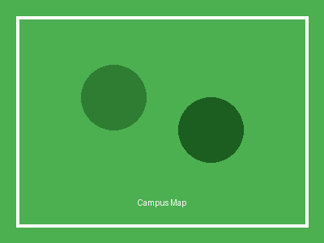
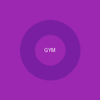
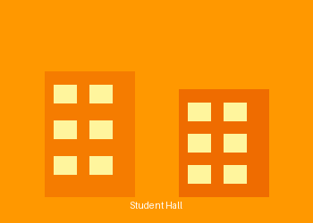

# student_living_accommodation_sample.pptx

# student_living_accommodation_sample.pptx

# Student Living Accommodation

Summary pack (June 2024 prices)

# What this booklet covers

- On-campus living across three campuses
- Catered vs self-catered options
- Benefits (bills included, security, quieter living, insurance)
- MealPass and Active Living package
- Hall options (on-campus + partner halls) and example prices

# On-campus living

- University Park: 10 halls + shared townhouses; en-suites available; catered &amp; self-catered
- Jubilee Campus: modern en-suites; community kitchens; Atrium food court
- Sutton Bonington: rural campus near Loughborough; Bonington Student Village + Eviton House

# Benefits of on-campus living

- Close to lectures, libraries, SU retail, and sports centres
- Free buses between campuses (travel links)
- 365-day trained security team
- All-inclusive bills + contents insurance (one fixed price)
- Accredited Quieter Living (alcohol-free + designated quiet areas)

# Outstanding catering (MealPass)

- Fresh meals with dietary options; sustainable ingredients (free-range eggs, Red Tractor meat, responsibly farmed fish)
- 12 meals/week: 5 breakfasts + 5 dinners (Mon–Fri) + 2 weekend meals (brunch or dinner)
- Flexible dining across halls
- Weekly £25 spending allowance at campus retail sites

# Active Living package

- Included sports &amp; fitness membership benefits
- Facilities: gym, courts, 4G pitches, 25m pool, sauna, and classes
- Exclusive hall social events and fitness classes
- *Only available at campus halls and Dagfa (all students can buy sports membership)

# Residential Experience Team

- Support 7 days/week for communal living, wellbeing advice, and guidance
- Community initiatives: sustainability, food insecurity, cultural events
- Inclusivity support (including disabilities that may not be visible)
- Individual needs support email: BR-AccomIndivNeeds@nottingham.ac.uk

# Booking your accommodation (high level)

- Make Nottingham your firm choice; wait 48 hours after accepting offer
- Register on the accommodation portal
- Select minimum of 3 preferences and order them
- Choose package additions and checkout
- Applications usually open in early April

# Halls at a glance (examples)

- Ancaster Hall — 39 weeks | Catered | From £234
- Cavendish Hall — 39 weeks | Catered | From £277
- Cripps Hall — 39 weeks | Catered | From £227; 44/51 weeks | Self-catered | From £137
- Southwell Hall — 39 weeks | Self-catered | From £132
- Newark Hall — 39 weeks | Catered/Self-catered | From £134
- Raleigh Park (partner hall) — 44 weeks | Self-catered | From £125

---

## Images (4 extracted)

### Image 1-1
- UUID: `1f11ca26-591c-61cc-a035-dcac0bca3104`
- Kind: picture
- Page: 1

<!-- image-uuid: 1f11ca26-591c-61cc-a035-dcac0bca3104 -->

### Image 3-2
- UUID: `1f11ca26-5927-65a6-a760-7c55ffc6fa96`
- Kind: picture
- Page: 3

<!-- image-uuid: 1f11ca26-5927-65a6-a760-7c55ffc6fa96 -->

### Image 6-3
- UUID: `1f11ca26-592f-668c-b946-c6bd2a126a7c`
- Kind: picture
- Page: 6

<!-- image-uuid: 1f11ca26-592f-668c-b946-c6bd2a126a7c -->

### Image 8-4
- UUID: `1f11ca26-5938-6d6e-aceb-2f4d18bf7efd`
- Kind: picture
- Page: 8

<!-- image-uuid: 1f11ca26-5938-6d6e-aceb-2f4d18bf7efd -->
